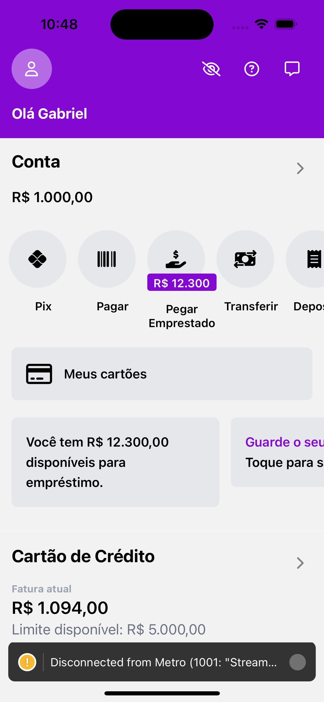

## 📸 Capturas de Tela




# Nubank App Clone - Frontend

Este projeto é um clone do frontend do aplicativo Nubank, desenvolvido em **React Native** e estilizado com **NativeWind**. O objetivo é recriar a interface do usuário do aplicativo Nubank para fins de estudo e prática de desenvolvimento mobile.

## 🚀 Tecnologias Utilizadas

- **React Native**: Framework para desenvolvimento de aplicativos mobile nativos usando JavaScript e React.
- **NativeWind**: Biblioteca de estilo para React Native, que permite utilizar classes utilitárias para estilização, inspirado no Tailwind CSS.

## 💡 Funcionalidades Implementadas

- Interface similar ao Nubank, com design moderno e responsivo.
- Alternância entre temas claro e escuro.
- Exibição de informações de conta com a opção de ocultar ou mostrar detalhes.
- Componentes personalizados como botões, ícones e cards.
- Navegação simples entre telas.

## 📸 Capturas de Tela

(_Adicione capturas de tela do app aqui, se possível_)

## 🔧 Instalação e Execução

Siga os passos abaixo para executar este projeto em sua máquina:

1. Clone o repositório:
    ```bash
    git clone https://github.com/seu-usuario/nubank-clone.git
    ```

2. Navegue até o diretório do projeto:
    ```bash
    cd nubank-clone
    ```

3. Instale as dependências:
    ```bash
    npm install
    ```

4. Execute o projeto no emulador ou dispositivo físico:
    ```bash
    npx react-native run-android # para Android
    npx react-native run-ios # para iOS
    ```

## 📚 Como Contribuir

Se você deseja contribuir para este projeto:

1. Faça um fork do repositório.
2. Crie uma branch com sua feature ou correção de bug: `git checkout -b minha-feature`.
3. Commit suas mudanças: `git commit -m 'Minha nova feature'`.
4. Envie para a branch principal: `git push origin minha-feature`.
5. Abra um pull request para revisão.

## 📄 Licença

Este projeto está sob a licença MIT. Veja o arquivo [LICENSE](LICENSE) para mais detalhes.

---

Desenvolvido por **Seu Nome** ✨
